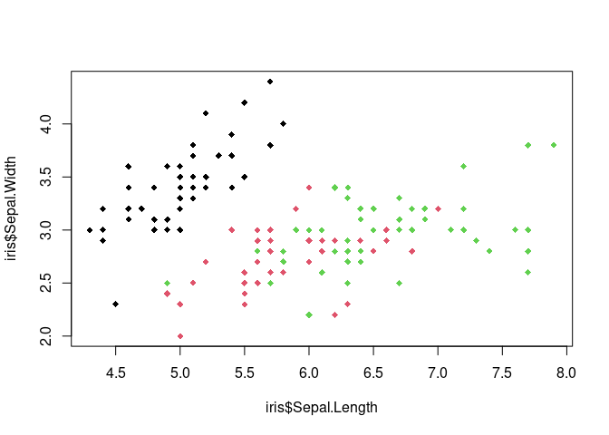

Kenya Food Prices
================

``` r
data("iris")
plot(iris$Sepal.Length, iris$Sepal.Width, col = iris$Species, pch = 18)
```

<!-- -->

``` r
## Last Run On
time_run <- paste(format(Sys.time(), "%Y-%m-%d %H:%M:%S"),  Sys.timezone())
cat("Last Run On: ", time_run)
```

    ## Last Run On:  2024-06-21 10:22:23 Africa/Nairobi
