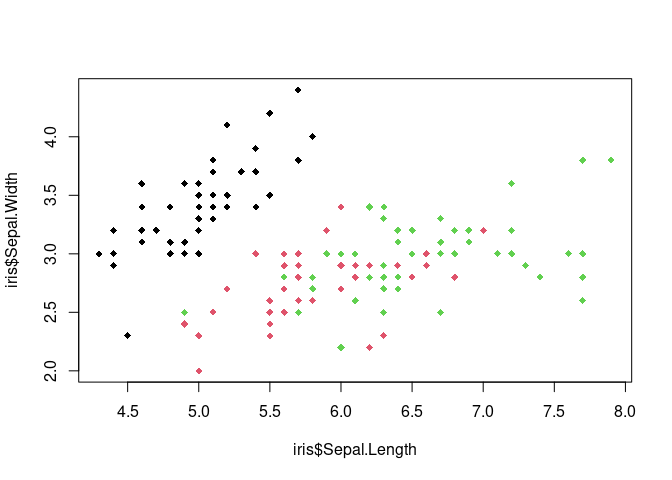

Kenya Food Prices
================

``` r
data("iris")
plot(iris$Sepal.Length, iris$Sepal.Width, col = iris$Species, pch = 18)
```

<!-- -->

``` r
sample <- sample(1:150, sample(1:10, 1))
iris[sample, ]
```

    ##     Sepal.Length Sepal.Width Petal.Length Petal.Width    Species
    ## 126          7.2         3.2          6.0         1.8  virginica
    ## 83           5.8         2.7          3.9         1.2 versicolor

``` r
## Last Run On
time_run <- paste(format(Sys.time(), "%Y-%m-%d %H:%M:%S"),  Sys.timezone())
cat("Last Run On: ", time_run)
```

    ## Last Run On:  2024-06-21 10:49:11 Africa/Nairobi
