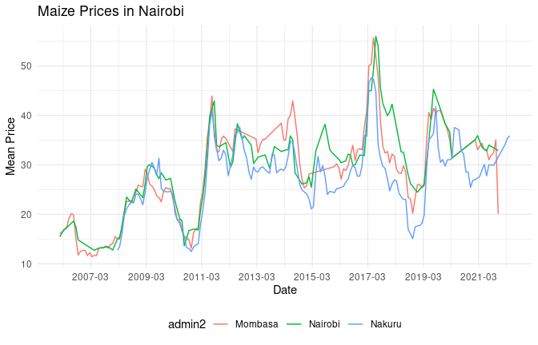

Kenya Food Prices
================

- This will be a part of big project I want to do in the future. This is
  just the beginning at first Iwant to set github actions to run this
  code and then I will add more code to it.

``` r
library(rhdx)
library(tidyverse)
library(data.table)

#remotes::install_github("dickoa/rhdx")

set_rhdx_config(hdx_site = "prod")

ke_food_prices <- pull_dataset("wfp-food-prices-for-kenya") %>% 
    get_resource(1) %>%
    read_resource() %>%
    setDT()

save(ke_food_prices, file = "data/ke_food_prices.rda")
```

``` r
nairobi <- ke_food_prices[admin2 == "Nairobi" & pricetype == "Wholesale",]

admin2_select <- c("Nairobi", "Mombasa", "Nakuru")

nmk_counties <- ke_food_prices[admin2 %in% admin2_select]

# commodotiy Maize filter
nmk_counties_maize <- nmk_counties[commodity == "Maize" & pricetype == "Wholesale",]

## group by date and get the mean price
nmk_counties_maize[, .(mean_price = mean(price)), by = .(date, admin2)] %>%
    ggplot(aes(x = date, y = mean_price, color = admin2)) +
    geom_line() +
    labs(title = "Maize Prices in Nairobi",
         x = "Date",
         y = "Mean Price") +
    scale_x_date(date_labels = "%Y-%m", breaks = "24 month") +
    theme_minimal()+
    theme(legend.position = "bottom")
```

<!-- -->

``` r
## Last Run On
time_run <- paste(format(Sys.time(), "%Y-%m-%d %H:%M:%S"),  Sys.timezone())
cat("Last Run On: ", time_run)
```

    ## Last Run On:  2024-06-21 06:25:30 Africa/Nairobi

- **Thanks to WFP for providing the data on Humanitarian Data Exchange
  (HDX)**
